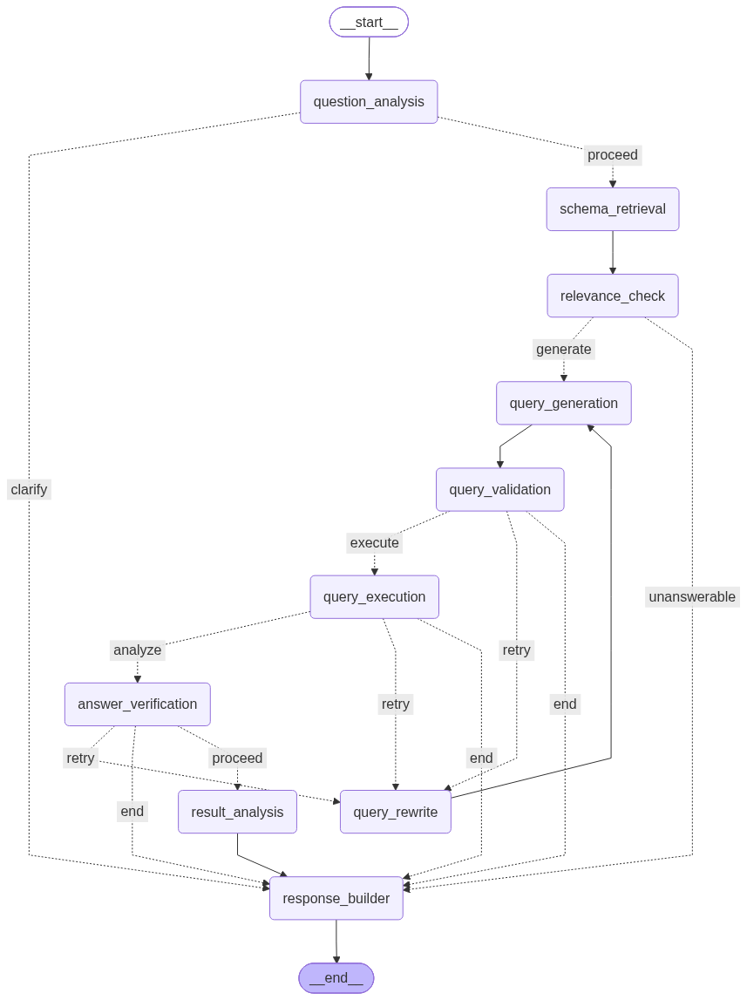

# db-agent-backend

A FastAPI backend that lets a user connect a data source (Postgres, MySQL, CSV upload,
or Google Sheets), select which tables to expose, and ask plain-English questions about
that data. Questions are turned into safe, validated SQL by a LangGraph agent, executed
against the real data source, and explained back in natural language — with
auto-suggested charts or KPI tiles, and an interactive, editable Entity-Relationship
Diagram.

## Table of contents

- [Tech stack](#tech-stack)
- [High-level architecture](#high-level-architecture)
- [Agent diagram](#agent-diagram)
- [The agent pipeline, in detail](#the-agent-pipeline-in-detail)
- [Data adapters](#data-adapters)
- [The semantic layer](#the-semantic-layer)
- [ERD and relationship editing](#erd-and-relationship-editing)
- [Security model](#security-model)
- [Data model (metadata DB)](#data-model-metadata-db)
- [Setup](#setup)
- [Environment variables](#environment-variables)
- [Project structure](#project-structure)
- [API reference](#api-reference)
- [Adding a new data source](#adding-a-new-data-source)
- [Known limitations / follow-ups](#known-limitations--follow-ups)

## Tech stack

| Concern | Choice |
|---|---|
| Web framework | FastAPI, served by Uvicorn |
| Agent orchestration | LangGraph (`StateGraph`), checkpointed per chat session |
| LLM runtime | Ollama, via `langchain-ollama` (`ChatOllama` for chat, `OllamaEmbeddings` for embeddings) |
| SQL parsing/transpilation | `sqlglot` |
| Metadata database | SQLAlchemy 2.x + Alembic migrations (Postgres in practice — also the LangGraph checkpoint store) |
| Vector store | Qdrant, via `qdrant-client` |
| In-process SQL engine for flat-file sources | DuckDB (used by the CSV and Google Sheets adapters) |
| Auth | Google OAuth (Authlib) + JWT session cookie |
| Secrets at rest | Fernet symmetric encryption (`cryptography`) |
| Observability | LangSmith tracing (optional, toggled by env var) |
| Data source clients | `sqlalchemy` (Postgres/MySQL), `pymysql`, `psycopg[binary]`/`psycopg2-binary`, `gspread` + `google-auth` (Sheets) |

## High-level architecture

```
┌──────────────┐      ┌────────────────────────────────────────────┐      ┌───────────────┐
│   Frontend    │◄───►│                FastAPI app                  │◄───►│  Metadata DB   │
│  (Next.js)    │      │  /api/v1/{auth,connections,schema,erd,      │      │  (Postgres)    │
└──────────────┘      │           semantic,chat,health}             │      │  users,        │
                       └───────────────────┬──────────────────────┘      │  connections,  │
                                            │                             │  chat_sessions,│
                                            ▼                             │  chat_messages │
                                   ┌──────────────────┐                   └───────────────┘
                                   │  LangGraph agent  │◄───── checkpoints (per chat session) ──┘
                                   │  (question → SQL  │
                                   │   → execution →   │      ┌───────────────┐
                                   │   answer)         │◄───►│    Qdrant      │
                                   └────────┬──────────┘      │ (semantic-layer│
                                            │                 │  embeddings)   │
                                            ▼                 └───────────────┘
                                 ┌────────────────────┐
                                 │   Data adapter       │
                                 │ (Postgres / MySQL /  │────► the user's actual data source
                                 │  CSV / Google Sheets) │      (never touched except read-only
                                 └────────────────────┘      SELECT queries)
```

The metadata DB never stores the user's actual business data — only connection
configuration (encrypted), which tables are selected, and chat history/results (capped
at 50 rows per stored message).

## Agent diagram

<p align="center">
  
</p>

## The agent pipeline, in detail

Implemented as a `langgraph.graph.StateGraph` (`agent/graph.py`), with one Postgres
checkpoint thread **per chat session** (`thread_id = session.id`) — so each conversation
gets independent, resumable agent state, and switching sessions never leaks state between
them.

```
question_analysis
      │ (needs_clarification?) ──yes──► response_builder ──► END
      │ no
      ▼
schema_retrieval
      ▼
relevance_check
      │ (answerable?) ──no──► response_builder ──► END
      │ yes
      ▼
query_generation ◄────────────────────────────┐
      ▼                                        │
query_validation                               │
      │ (valid?) ──no, retries left──► query_rewrite ┘
      │           ──no, retries exhausted──► response_builder ──► END
      │ yes
      ▼
query_execution
      │ (succeeded?) ──no, retries left──► query_rewrite (loops back up)
      │               ──no, retries exhausted──► response_builder ──► END
      │ yes
      ▼
answer_verification
      │ (result actually answers the question?) ──no, retries left──► query_rewrite (loops back up)
      │                                           ──no, retries exhausted, or yes──► proceed
      ▼
result_analysis
      ▼
response_builder ──► END
```

**Node responsibilities:**

- **`question_analysis`** — resets all per-turn state fields (critical: state persists
  across turns on the same checkpoint thread, so leftover errors/retries from a previous
  question must be explicitly cleared every time). Then makes an LLM call that:
  - identifies **intent** (a single aggregate? a ranked list? a trend? not a data
    question at all?)
  - resolves ambiguity into stated **assumptions** rather than guessing silently or
    always asking (e.g. "top" → assumes "by revenue" and says so)
  - produces `normalized_question` — the fully explicit rewrite that every downstream
    node uses instead of the raw question
  - sets `needs_clarification` only when the question genuinely isn't a data question,
    or is too vague for any reasonable assumption — short-circuiting straight to the
    response instead of wasting a retrieval + generation cycle
  - falls back safely to face-value handling if the LLM's response doesn't parse

- **`schema_retrieval`** — loads the connection's adapter and selected tables, runs two
  Qdrant vector searches (DDL text + semantic-layer text) against `normalized_question`,
  unions the resulting tables, and calls `adapter.get_schema()` for real column/PK/FK
  metadata. It then builds `known_relationships`: real FK-derived edges from the schema,
  merged with any semantic-layer relationship overrides/removals (via the same
  `build_erd` + `merge_semantic_relationships` logic the ERD endpoint uses), scoped to
  just the tables retrieved for this question. This is what lets a manually
  added/edited/removed relationship actually change how the agent joins tables — not
  just how the ERD diagram looks.

- **`relevance_check`** — one LLM call: can this question be answered using *only* the
  tables/columns described in the retrieved context? If not, routes straight to the
  response with an explanation, instead of letting the LLM hallucinate a plausible-looking
  but wrong query.

- **`query_generation`** — the LLM is always asked to write **PostgreSQL-flavored SQL**,
  regardless of the actual target dialect. The prompt includes the schema, the
  `known_relationships` join hints, and semantic-layer business context. After
  generation, `sqlglot.transpile(sql, read="postgres", write=target_dialect)` converts it
  to the real dialect (MySQL, DuckDB for CSV/Sheets). This means the model only ever has
  to reason in one SQL flavor, and dialect quirks are handled deterministically instead of
  hoping the model gets them right.

- **`query_validation`** — the security gate (see [Security model](#security-model)
  below): AST-based read-only/single-statement enforcement, plus a check that every
  referenced table exists in both the real schema and the user's selected-table allowlist.

- **`query_rewrite`** — on any failure (validation, execution, or verification), feeds
  the specific error/mismatch back into the next `query_generation` call and increments
  `retry_count`, up to `max_retries` (default 3, configurable via `AGENT_MAX_RETRIES`).

- **`query_execution`** — runs the validated query through the adapter with a row limit
  (`QUERY_ROW_LIMIT`) and statement timeout (`QUERY_TIMEOUT_SECONDS`).

- **`answer_verification`** — a correctness check beyond "did it execute": the LLM is
  shown the question, the query, and a sample of the actual result, and asked whether the
  result *genuinely* answers the question (right aggregation, right filter, right
  grouping) — not just whether it ran without error. Deliberately biased toward "yes"
  when uncertain, to avoid discarding correct answers over an overly strict judgment call.
  A clear mismatch with retries remaining loops back to regeneration with the specific
  problem as feedback; if retries run out, the best-effort answer is still returned, with
  an explicit caveat appended by `response_builder` rather than silently presenting a
  possibly-wrong number with full confidence.

- **`result_analysis`** — writes the final natural-language answer, and calls
  `suggest_visualizations` (LLM-first chart/KPI suggestion, validated against the real
  result columns before being trusted, with a heuristic fallback if the LLM call fails).

- **`response_builder`** — assembles the final `ChatResponse`, applying any verification
  caveat, and distinguishing three outcomes: a clean answer, an "unanswerable/needs
  clarification" message, or a validation/execution failure message — each with
  appropriate fields populated/nulled.

## Data adapters

A single interface (`adapters/base.py::DataSourceAdapter`) with five methods:
`test_connection`, `list_tables`, `get_schema`, `execute_query`, `sample_rows`.
Implementations:

| Adapter | Real database? | How it executes SQL |
|---|---|---|
| `PostgresAdapter` | Yes | Direct connection via SQLAlchemy, real FK/PK introspection via `inspect()` |
| `MySQLAdapter` | Yes | Same, via PyMySQL/SQLAlchemy |
| `CSVAdapter` | No | Uploaded CSV loaded into an in-memory DuckDB view |
| `GoogleSheetsAdapter` | No | Sheet loaded via `gspread`/`google-auth` into pandas, then into DuckDB — three auth modes: service account, OAuth (via the same Google login), or a public sheet + API key |

`adapters/factory.py` is a simple registry keyed by `source_type` — nothing outside the
adapter layer needs to know whether a connection is a real database or a flat file.

## The semantic layer

A per-connection YAML file at `{SEMANTIC_MAPPINGS_DIR}/{connection_id}.yaml`
(`semantic/models.py`, `semantic/loader.py`), holding:

- **`tables`** — business name + description per table and column, drafted by an LLM
  from the schema + a few sample rows (`semantic/drafter.py`), and editable afterward.
- **`relationships`** — manually added/edited relationships (from/to table+column,
  cardinality, and full participation: `from_optional`/`to_optional` for proper
  crow's-foot notation).
- **`removed_relationships`** — suppresses a relationship (typically FK-derived) from
  the ERD and from what the agent treats as a valid join. This **never** issues DDL
  against the real database — it only affects this app's view. Editing relationships is
  restricted to Postgres/MySQL connections (enforced server-side in
  `api/routes/semantic.py`); CSV/Sheets relationships are fully defined by the drafted
  semantic layer already, since there's no real FK to introspect or suppress.

Two genuinely separate effects, worth not conflating:

1. **Retrieval** — `semantic/vectorstore.py` embeds each table's business
   name/description/columns and indexes it in Qdrant. At question time, this is what gets
   vector-searched and passed into `query_generation` as business context.
2. **Join guidance** — `relationships`/`removed_relationships` feed into
   `known_relationships` (built in `schema_retrieval`), which becomes explicit join hints
   in the SQL-generation prompt, and separately into the ERD's edges. Both paths share the
   exact same merge function (`erd_builder.merge_semantic_relationships`), so what you see
   in the diagram is what the agent actually knows.

## ERD and relationship editing

`GET /connections/{id}/erd` returns nodes (tables/columns) and edges. Edges come from two
sources merged together:

- **FK-derived** (`source: "fk"`) — from live schema introspection. Optionality is
  derived automatically: a nullable FK column means that side is optional (zero-or-one);
  the reverse side defaults to "zero-or-many" since that can't be determined from a single
  column's constraints alone (it's a data fact, not a schema one), but is editable.
- **Semantic** (`source: "semantic"`) — manually added, or an override of an FK edge with
  the same key (same four columns) — this is how "editing" a real FK relationship's
  cardinality/optionality works without any DDL.

`PUT /connections/{id}/semantic/relationships` is the dedicated endpoint for
add/edit/remove, gated to Postgres/MySQL (`source_type` check). The generic
`PUT /connections/{id}/semantic` endpoint (for table/column business metadata) explicitly
discards any relationship fields sent through it, so it can't be used to bypass that
restriction.

## Security model

Multiple independent, deterministic layers — the LLM is never trusted to enforce any of
these on its own:

1. **AST-based read-only enforcement** (`security/sql_guard.py`) — parses the query with
   `sqlglot`, rejects anything that isn't a single `SELECT` statement (no stacked
   statements, no destructive keywords, no comment-based tricks). AST-based rather than
   keyword/string matching, which is much harder to bypass with formatting tricks.
2. **Table/schema allowlist** (`query/validator.py`) — every referenced table must exist
   in *both* the real introspected schema *and* the user's `TableSelection` allowlist.
   This is the actual security boundary: even a successfully prompt-injected LLM can't
   read a table the user never selected, because this check doesn't depend on what the
   LLM "decided" to do.
3. **Row limit + statement timeout** on every execution — bounds both result size and
   worst-case query runtime (`QUERY_ROW_LIMIT`, `QUERY_TIMEOUT_SECONDS`).
4. **Credential encryption at rest** (`security/credentials.py`) — every stored
   connection config and the Google OAuth refresh token are Fernet-encrypted.
5. **AuthN/AuthZ on every route** — JWT session cookie (Google OAuth login); every
   connection/session/message lookup is scoped to `current_user.id` via
   `_get_owned_connection*`/`_get_owned_session` helpers, so one user can never read
   another's connections or chat history via ID guessing.

## Data model (metadata DB)

| Table | Purpose |
|---|---|
| `users` | Google identity, encrypted Sheets refresh token, whether Sheets access was granted |
| `connections` | Encrypted data-source config, `source_type`, per-connection `semantic_top_k` |
| `table_selections` | Which tables (and optionally columns) are exposed to the agent per connection |
| `chat_sessions` | One row per conversation; `title` auto-set from the first question, renamable |
| `chat_messages` | One row per user question and one per assistant response (`response_json` holds the full `ChatResponse`, rows capped at 50) |

LangGraph's own checkpoint tables (`checkpoints`, `checkpoint_writes`, etc.) live in the
same Postgres database, managed by `PostgresSaver.setup()` at startup — not by Alembic.

## Setup

### Requirements

- Python 3.11+
- [uv](https://docs.astral.sh/uv/)
- PostgreSQL (metadata DB **and** LangGraph checkpoint store — required, not optional,
  even in development)
- Qdrant
- An Ollama-compatible endpoint serving both a chat model and an embedding model

### Steps

1. Install dependencies:
   ```bash
   uv sync
   ```

2. Start Qdrant (and, optionally, disposable Postgres/MySQL containers to test against):
   ```bash
   docker compose up -d
   ```

3. Create `.env` in the project root — see [Environment variables](#environment-variables)
   for the full list. At minimum you need `METADATA_DB_URL`,
   `CREDENTIAL_ENCRYPTION_KEY`, `JWT_SECRET_KEY`, and `OLLAMA_BASE_URL`.

   Generate the encryption key with:
   ```bash
   python -c "from cryptography.fernet import Fernet; print(Fernet.generate_key().decode())"
   ```

4. Run migrations:
   ```bash
   uv run alembic upgrade head
   ```

5. Start the server:
   ```bash
   uv run uvicorn db_agent.main:app --reload --port 8000
   ```

API base: `http://localhost:8000/api/v1`. Interactive docs: `http://localhost:8000/docs`.

## Environment variables

All defined in `core/config.py` (`Settings`, loaded via `pydantic-settings` from `.env`).

| Variable | Default | Notes |
|---|---|---|
| `APP_ENV` | `development` | |
| `DEBUG` | `true` | |
| `CORS_ORIGINS` | `["http://localhost:3000","http://localhost:5173"]` | JSON array |
| `OLLAMA_BASE_URL` | *(dev tunnel URL)* | **Change this** — point at your own Ollama instance |
| `OLLAMA_MODEL` | `gpt-oss:latest` | Chat model |
| `EMBEDDING_MODEL` | `qwen3-embedding:latest` | Embedding model |
| `AGENT_MAX_RETRIES` | `3` | Regeneration attempts across validation/execution/verification failures |
| `METADATA_DB_URL` | `sqlite:///./db_agent_metadata.db` | **Must be Postgres in practice** — the LangGraph checkpointer requires `PostgresSaver` |
| `CREDENTIAL_ENCRYPTION_KEY` | *(required, no default)* | Fernet key |
| `JWT_SECRET_KEY` | *(required, no default)* | |
| `JWT_ALGORITHM` | `HS256` | |
| `JWT_EXPIRE_MINUTES` | `10080` (7 days) | |
| `QUERY_ROW_LIMIT` | `1000` | |
| `QUERY_TIMEOUT_SECONDS` | `30` | |
| `UPLOAD_DIR` | `./storage/uploads` | CSV uploads |
| `SEMANTIC_MAPPINGS_DIR` | `./storage/semantic` | Semantic-layer YAML files |
| `QDRANT_URL` | `http://localhost:6333` | |
| `SEMANTIC_TOP_K_DEFAULT` | `8` | Overridable per connection |
| `GOOGLE_OAUTH_CLIENT_ID` / `_SECRET` | `""` | Login |
| `GOOGLE_OAUTH_REDIRECT_URI` | `http://localhost:8000/api/v1/auth/google/callback` | |
| `GOOGLE_API_KEY` | `""` | For "public sheet" Google Sheets connections |
| `GOOGLE_SHEETS_SCOPE` | `.../auth/spreadsheets.readonly` | |
| `GOOGLE_SHEETS_REDIRECT_URI` | `http://localhost:8000/api/v1/auth/google/sheets/callback` | |
| `GOOGLE_SERVICE_ACCOUNT_JSON` | `None` | Alternate Sheets auth mode |
| `FRONTEND_URL` | `http://localhost:3000` | Post-OAuth redirect target |
| `LANGSMITH_TRACING` | `false` | |
| `LANGSMITH_API_KEY` / `_PROJECT` / `_ENDPOINT` | | Only used if tracing is enabled |

## Project structure

```
src/db_agent/
├── main.py                    # FastAPI app: middleware, router registration, DB init
├── core/
│   ├── config.py               # Settings (env-driven)
│   ├── logging.py
│   └── observability.py        # LangSmith setup
├── db/
│   ├── models.py                # User, Connection, TableSelection, ChatSession, ChatMessage
│   └── session.py               # SQLAlchemy engine/session, init_db()
├── auth/
│   ├── oauth.py                  # Google OAuth flow (login + Sheets scope)
│   ├── jwt.py                    # Session token issue/verify
│   └── dependencies.py           # get_current_user
├── adapters/                    # DataSourceAdapter implementations + factory
│   ├── base.py, factory.py, config_resolver.py, duckdb_utils.py
│   ├── postgres_adapter.py, mysql_adapter.py
│   └── csv_adapter.py, gsheets_adapter.py
├── security/
│   ├── sql_guard.py               # AST-based read-only/single-statement enforcement
│   └── credentials.py             # Fernet encrypt/decrypt
├── query/
│   ├── generator.py                # LLM SQL writer + Postgres→target dialect transpile
│   ├── validator.py                 # table/schema allowlist check
│   └── executor.py                  # row-limited, timeout-bounded execution
├── introspection/
│   ├── ddl_vectorstore.py            # schema-text embedding/retrieval
│   └── erd_builder.py                # FK extraction + semantic-relationship merge
├── semantic/
│   ├── models.py                      # SemanticLayer, RelationshipSemantic, etc.
│   ├── loader.py                      # YAML read/write
│   ├── drafter.py                     # LLM-drafts table/column business metadata
│   └── vectorstore.py                 # embeds/searches semantic-layer text in Qdrant
├── results/
│   ├── processor.py                    # result shaping
│   └── visualization.py                # chart/KPI suggestion (LLM-first + heuristic fallback)
├── agent/
│   ├── state.py                        # AgentState TypedDict
│   ├── checkpointer.py                 # Postgres-backed LangGraph checkpointer
│   ├── context.py                       # per-connection adapter/config loading
│   ├── graph.py                         # node wiring, routing
│   └── nodes/                           # one file per pipeline step (see above)
├── schemas/                             # Pydantic request/response models
└── api/routes/                          # auth, connections, schema, erd, semantic, chat, health
alembic/versions/                        # DB migrations
scripts/                                 # manual test scripts + generate_agent_graph.py
```

## API reference

All routes are under `/api/v1`, all require the session cookie except `/auth/*` and `/health`.

**Auth**
| Method | Path | Purpose |
|---|---|---|
| GET | `/auth/google/login` | Start Google OAuth |
| GET | `/auth/google/callback` | OAuth callback, issues session cookie |
| GET | `/auth/me` | Current user |
| POST | `/auth/logout` | Clear session |

**Connections**
| Method | Path | Purpose |
|---|---|---|
| POST | `/connections` | Create a Postgres/MySQL connection |
| POST | `/connections/csv` | Upload a CSV as a connection |
| POST | `/connections/gsheets` | Create a Google Sheets connection |
| GET | `/connections` | List the current user's connections |
| GET | `/connections/{id}` | Get one connection |
| POST | `/connections/{id}/test` | Test connectivity |
| DELETE | `/connections/{id}` | Delete a connection (cascades table selections, sessions) |
| GET | `/connections/{id}/tables` | List available tables |
| POST | `/connections/{id}/tables/select` | Set the selected-tables allowlist |
| GET | `/connections/{id}/tables/selected` | Get the current allowlist |

**Schema & ERD**
| Method | Path | Purpose |
|---|---|---|
| GET | `/connections/{id}/schema` | Introspected schema for selected tables |
| GET | `/connections/{id}/erd` | Merged FK + semantic edges, with cardinality/optionality |

**Semantic layer**
| Method | Path | Purpose |
|---|---|---|
| POST | `/connections/{id}/semantic/draft` | LLM-draft table/column business metadata |
| GET | `/connections/{id}/semantic` | Read the semantic layer |
| PUT | `/connections/{id}/semantic` | Update table/column metadata (relationships ignored here) |
| PUT | `/connections/{id}/semantic/relationships` | Add/edit/remove relationships (Postgres/MySQL only) |
| PATCH | `/connections/{id}/semantic-config` | Set `semantic_top_k` |

**Chat**
| Method | Path | Purpose |
|---|---|---|
| POST | `/chat` | Ask a question (creates a session if `session_id` omitted) |
| POST | `/chat/sessions` | Explicitly create an empty session |
| GET | `/chat/sessions?connection_id=` | List sessions for a connection |
| PATCH | `/chat/sessions/{id}` | Rename a session |
| DELETE | `/chat/sessions/{id}` | Delete a session (and its LangGraph checkpoint state) |
| GET | `/chat/sessions/{id}/history` | Full message history |

**Health**
| Method | Path | Purpose |
|---|---|---|
| GET | `/health` | Liveness check |

## Adding a new data source

1. Implement `DataSourceAdapter` (`adapters/base.py`) — `test_connection`, `list_tables`,
   `get_schema`, `execute_query`, `sample_rows`.
2. Register it in `adapters/factory.py`'s registry, keyed by a new `source_type` string.
3. Confirm `sqlglot` recognizes the dialect name you use (`sqlglot.dialects.DIALECTS`) —
   generation always happens in Postgres SQL and gets transpiled to this dialect
   automatically.

Nothing in the agent graph, ERD builder, or semantic layer needs to change — they only
ever go through the adapter interface and a `dialect` string.